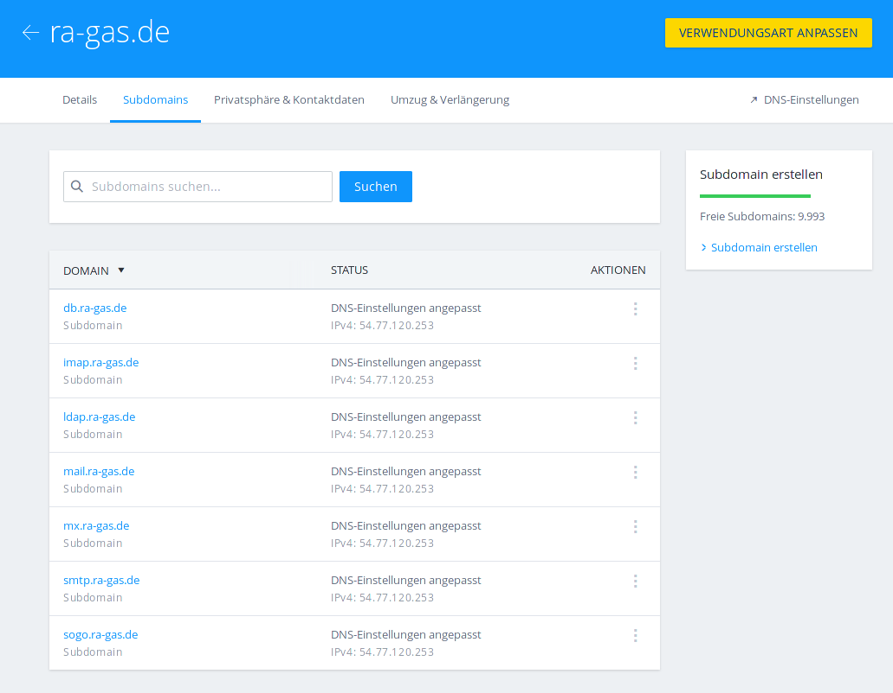

# DNS
## Verschiedene Domain Namen für verschiedene Dienste

Im Laufe dieser Anleitung konfigurieren wir sehr viele Dienste auf nur einem physischem Rechner. Es würde also technisch ausreichen nur einen DNS Record für alle Dienste zu erstellen und alle Dienste auf diese eine Adresse zu konfigurieren.

Das skalliert aber nicht. Das heißt, wenn wir mal annehmen das unsere Dienste durchschlagenden Erfolg haben werden, dann wird es irgendwann einmal nötig sein, für stark belasteten Dienste, den Webserver zum Beispiel,  einen separaten Rechner zu stellen. Zeigen nun alle Konfigurationen auf nur einen Rechnernamen, dann wird das kompliziert. Haben alle Dienste aber eigenen URL's (Rechnernamen; DNS Domain Namen) dann ist dieses Problem schon im Keim erstickt, noch bevor es ein richtiges Problem wird.

## Übersicht der Verwendeten Domain Namen
|Domain Name|Verwendung
|:---|:------|
|mail.ra-gas.de|Dieser Record sollte auf den IMAP und den SMTP Server zeigen. Ich verwende ihn auch in der SOGo Konfiguration|
|sogo.ra-gas.de|wie der *mail* Record, aber speziell für die SOGo Groupware Installation|
|imap.ra-gas.de|Posteingangsserver|
|smtp.ra-gas.de|Postausgangsserver|
|ldap.ra-gas.de|der OpenLDAP Server|
|db.ra-gas.de|PostgreSQL Server|
|mx.ra-gas.de|für den DNS MX Record|

## Beispiel Konfiguration
Meine Domains sind bei 1und1/ IONOS gehostet. Für dieses Buch verwende ich daher auch den DNS Konfigurator von 1und1/ IONOS. Alle hier besprochenen Themen sind aber auch auf alle anderen Provider anwendbar.

