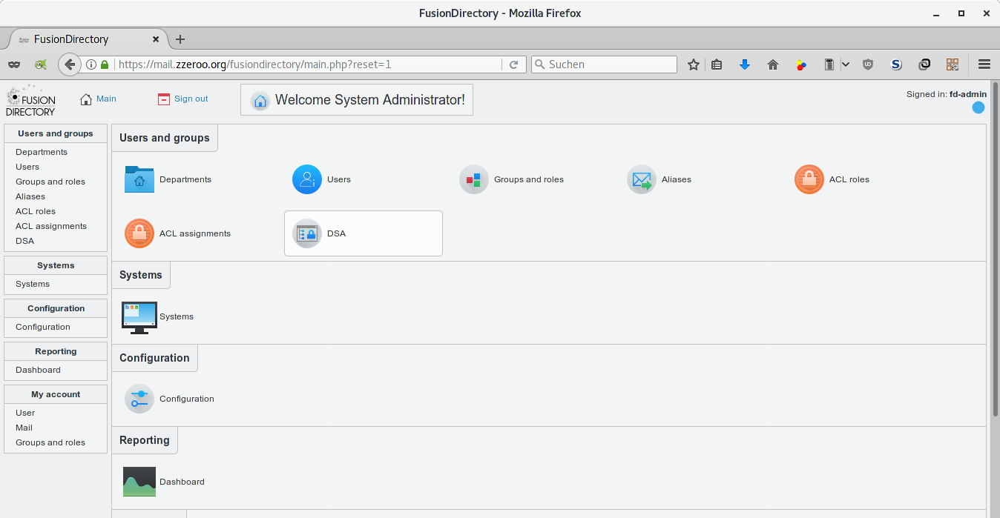
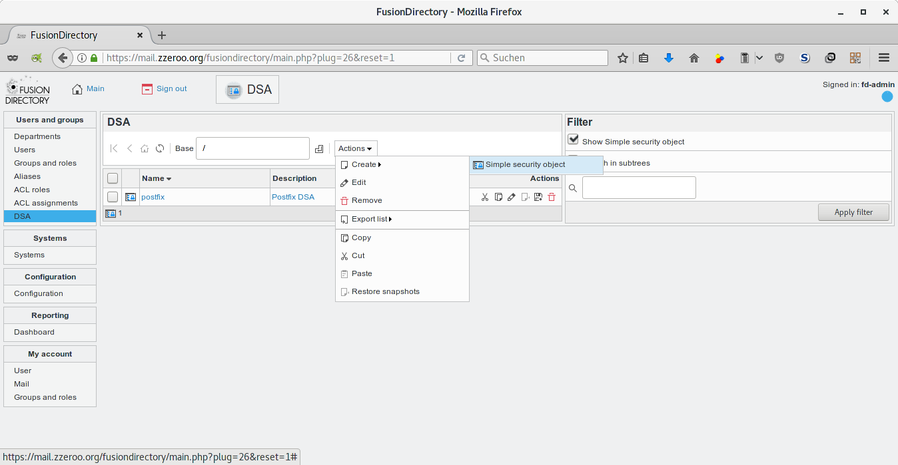
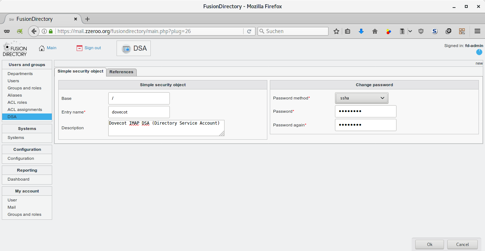
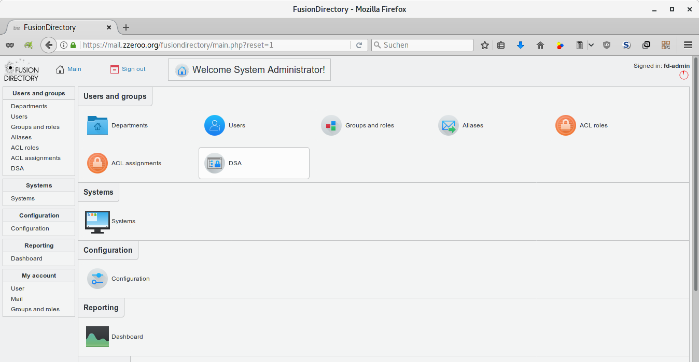
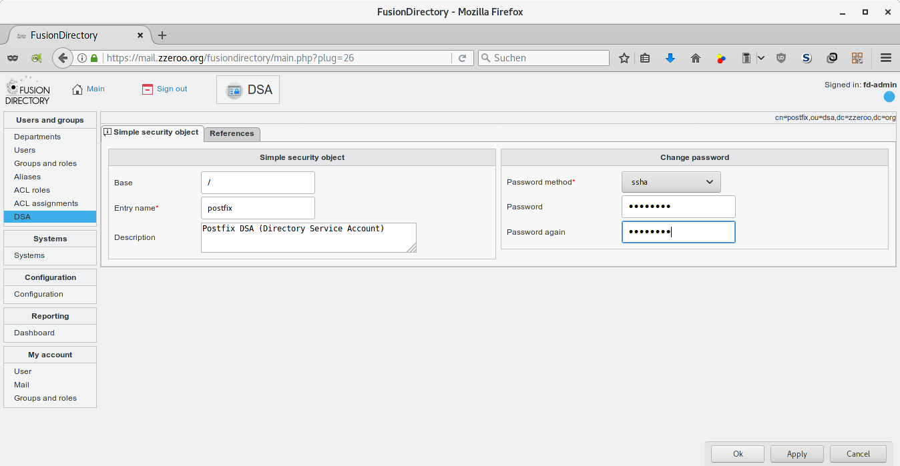
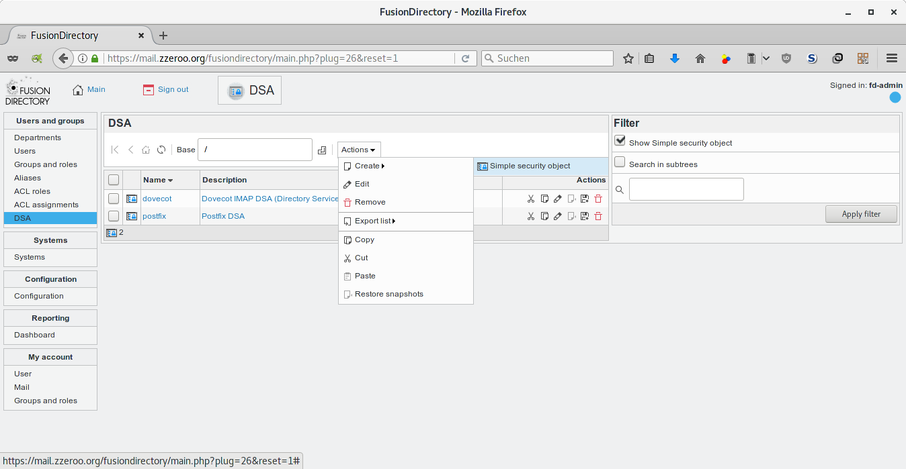
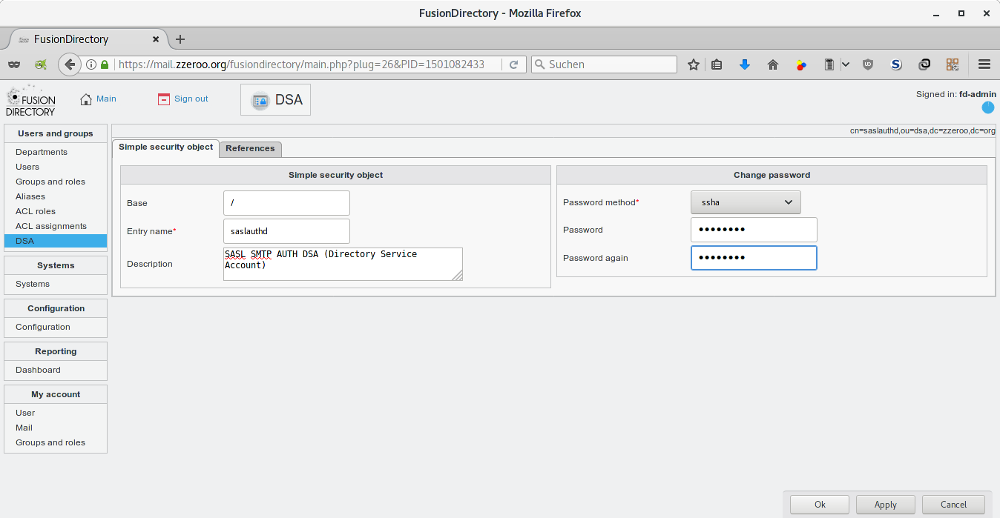
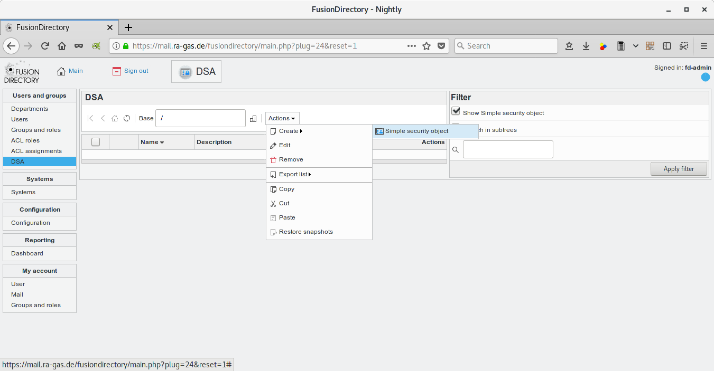
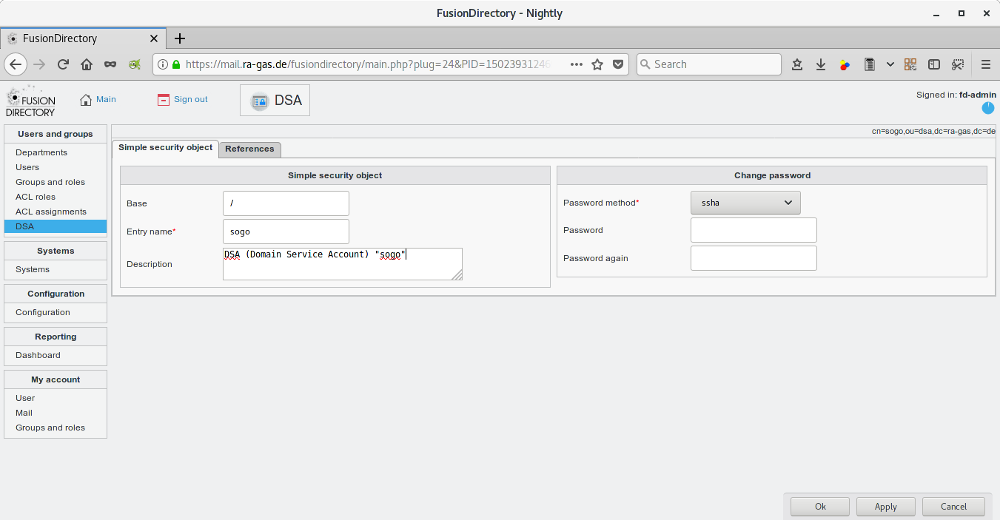

# DSA Benutzer anlegen

## Dovecot

||
|:---|---|
Base|/
Entry name|`dovecot`
Description|`DSA (Domain Service Account) "dovecot"`
Password method|`SSHA`

## Postfix

||
|:---|---|
Base|/
Entry name|`postfix`
Description|`DSA (Domain Service Account) "postfix"`
Password method|`SSHA`

## saslauthd

||
|:---|---|
Base|/
Entry name|`saslauthd`
Description|`DSA (Domain Service Account) "saslauthd"`
Password method|`SSHA`

## SOGo

||
|:---|---|
Base|/
Entry name|`sogo`
Description|`DSA (Domain Service Account) "sogo"`
Password method|`SSHA`

