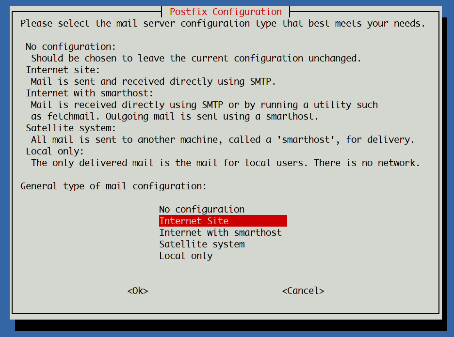
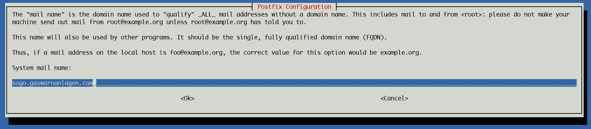

# Postfix/ Dovecot Installation

```bash
apt install postfix postfix-pcre postfix-ldap
```


Im Dialog wird "Internet Site" ausgewählt,



und der richtige Domainname eingetragen.




# Dovecot Installation

```bash
apt install dovecot-core dovecot-imapd dovecot-pop3d dovecot-lmtpd dovecot-ldap
```

# SASL für SMTP AUTH

```bash
apt install libsasl2-2 sasl2-bin
```