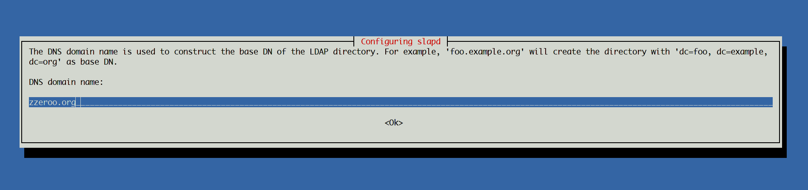
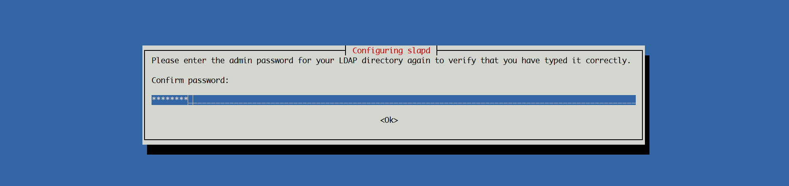
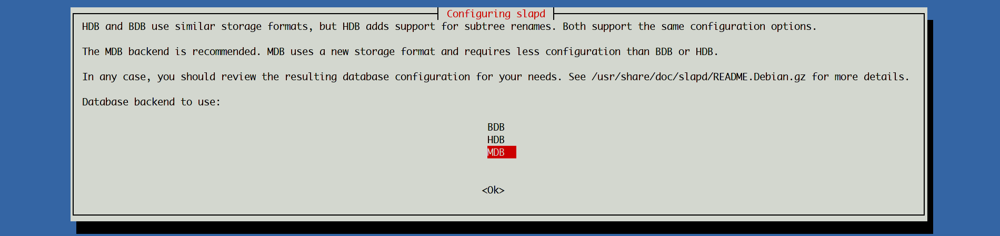
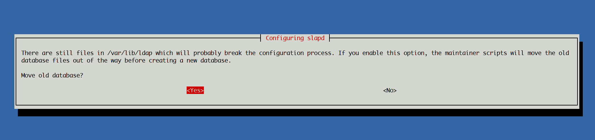

# OpenLDAP Konfiguration

[Debian Wiki OpenLDAP Setup][debian-wiki-openldap-setup]

Bei der OpenLDAP Installation wurde nur nach dem LDAP Password gefragt. Eine Vollständige Konfiguration kann mit folgendem Befehl gestartet werden.

```bash
dpkg-reconfigure -plow slapd
```

[](../images/slapd-konfiguration-1.png)

[](../images/slapd-konfiguration-2.png)

[](../images/slapd-konfiguration-3.png)

[](../images/slapd-konfiguration-4.png)

[](../images/slapd-konfiguration-5.png)

[](../images/slapd-konfiguration-6.png)

[](../images/slapd-konfiguration-7.png)


Die Konfigruation kann mit diesem Befehl geprüft werden:

```bash
ldapsearch -Y EXTERNAL -H ldapi:/// -b "cn=config" 
```

## Users und Groups anlegen

Datei `frontend.sogo.zzeroo.org.ldif` anlegen.

```ini
# frontend.sogo.zzeroo.org.ldif
dn: ou=users,dc=zzeroo,dc=org
objectClass: organizationalUnit
ou: users

dn: ou=groups,dc=zzeroo,dc=org
objectClass: organizationalUnit
ou: groups
```

```bash
ldapadd -f frontend.sogo.zzeroo.org.ldif -x -w ***REMOVED*** -D cn=admin,dc=zzeroo,dc=org
```

## Benutzer hinzufügen
### SOGo Administrator Account

Lege eine Datei `sogo.ldif` mit folgendem Inhalt an:

```ini
# sogo.ldif
dn: uid=sogo,ou=users,dc=zzeroo,dc=org
objectClass: top
objectClass: inetOrgPerson
objectClass: person
objectClass: organizationalPerson
uid: sogo
cn: SOGo Administrator
mail: sogo@zzeroo.org
sn: Administrator
givenName: SOGo
```

```bash
ldapadd -x -D cn=admin,dc=zzeroo,dc=org -w ***REMOVED*** -H ldap:// -f sogo.ldif
```

Password des Benutzers setzen

```bash
ldappasswd -x -D cn=admin,dc=zzeroo,dc=org -w ***REMOVED*** -H ldap:// uid=sogo,ou=users,dc=zzeroo,dc=org -s ***REMOVED***
```

### SOGo User

Eine Datei mit dem Namen `users.ldif` anlegen.

```ini
# users.ldif

# S. Mueller
dn: uid=smueller,ou=users,dc=zzeroo,dc=org
objectClass: top
objectClass: inetOrgPerson
objectClass: person
objectClass: organizationalPerson
uid: smueller
cn: Stefan Müller
mail: s.mueller@zzeroo.org
sn: Mueller
givenName: Stefan

# H. Kliemann
dn: uid=hkliemann,ou=users,dc=zzeroo,dc=org
objectClass: top
objectClass: inetOrgPerson
objectClass: person
objectClass: organizationalPerson
uid: hkliemann
cn: Helge Kliemann
mail: h.kliemann@zzeroo.org
sn: Kliemann
givenName: Helge

# I. Belser
dn: uid=ibelser,ou=users,dc=zzeroo,dc=org
objectClass: top
objectClass: inetOrgPerson
objectClass: person
objectClass: organizationalPerson
uid: ibelser
cn: Ingrid Belser
mail: i.belser@zzeroo.org
sn: Belser
givenName: Ingrid

# K. Keilhofer
dn: uid=kkeilhofer,ou=users,dc=zzeroo,dc=org
objectClass: top
objectClass: inetOrgPerson
objectClass: person
objectClass: organizationalPerson
uid: kkeilhofer
cn: Karlheinz Keilhofer
mail: k.keilhofer@zzeroo.org
sn: Keilhofer
givenName: Karlheinz

# D. Pfeiffer
dn: uid=dpfeiffer,ou=users,dc=zzeroo,dc=org
objectClass: top
objectClass: inetOrgPerson
objectClass: person
objectClass: organizationalPerson
uid: dpfeiffer
cn: Dennis Pfeiffer
mail: d.pfeiffer@zzeroo.org
sn: Pfeiffer
givenName: Dennis
```

Anschließend wird die `users.ldif` eingelesen.

```bash
ldapadd -x -D cn=admin,dc=zzeroo,dc=org -w ***REMOVED*** -H ldap:// -f users.ldif
```


### Passworte festlegen

Die Passworte (Parameter `-s`) können jederzeit und immer wieder geändert werden. Wird der Parameter `-s` weg gelassen dann wird ein zufälliges Passwort vergeben.

```bash
ldappasswd -x -D cn=admin,dc=zzeroo,dc=org -w ***REMOVED*** -H ldap:// uid=smueller,ou=users,dc=zzeroo,dc=org -s ***REMOVED***
ldappasswd -x -D cn=admin,dc=zzeroo,dc=org -w ***REMOVED*** -H ldap:// uid=hkliemann,ou=users,dc=zzeroo,dc=org -s kliemann
ldappasswd -x -D cn=admin,dc=zzeroo,dc=org -w ***REMOVED*** -H ldap:// uid=ibelser,ou=users,dc=zzeroo,dc=org -s belser
ldappasswd -x -D cn=admin,dc=zzeroo,dc=org -w ***REMOVED*** -H ldap:// uid=kkeilhofer,ou=users,dc=zzeroo,dc=org -s keilhofer
ldappasswd -x -D cn=admin,dc=zzeroo,dc=org -w ***REMOVED*** -H ldap:// uid=dpfeiffer,ou=users,dc=zzeroo,dc=org -s pfeiffer
```

# Indexing

Für mehr Performance und im SOGo Manual empfohlen müssen einige Spalten indiziert werdebn

```ini
# olcDbIndex.ldif
dn: olcDatabase={1}mdb,cn=config
changetype: modify
add: olcDbIndex
olcDbIndex: sn pres,sub,eq
- 
add: olcDbIndex
olcDbIndex: displayName pres,sub,eq
- 
add: olcDbIndex
olcDbIndex: default sub
-
add: olcDbIndex
olcDbIndex: mail,givenName eq,subinitial
-
add: olcDbIndex
olcDbIndex: dc eq
```

Anschließend wieder mit `ldapmodify` einlesen.

```bash
ldapmodify -Y EXTERNAL -H ldapi:/// -f olcDbIndex.ldif
```

Prüfen kann man das wieder mit dem Befehl:

```bash
ldapsearch -Y EXTERNAL -H ldapi:/// -b "cn=config"
```

----

# Tipp's

## Bind testen

```bash
# ldapwhoami -vvv -h <hostname> -p <port> -D <binddn> -x -w <passwd>
ldapwhoami -vvv -h localhost -D cn=admin,dc=zzeroo,dc=org -x -w ***REMOVED***
ldapwhoami -vvv -h localhost -D uid=smueller,ou=users,dc=zzeroo,dc=org -x -w ***REMOVED***
```

## Log Level prüfen/ setzen

[http://tutoriels.meddeb.net/openldap-log/][http://tutoriels.meddeb.net/openldap-log/]

Der erste Befehl liefert die aktuelle Loglevel Konfiguration.

```
ldapsearch -Y external -H ldapi:/// -b cn=config "(objectClass=olcGlobal)" olcLogLevel -LLL 
```

```yaml
# ldapsearch -Y external -H ldapi:/// -b cn=config "(objectClass=olcGlobal)" olcLogLevel -LLL 
SASL/EXTERNAL authentication started
SASL username: gidNumber=0+uidNumber=0,cn=peercred,cn=external,cn=auth
SASL SSF: 0
dn: cn=config
olcLogLevel: none
```

Zum Ändern erstellen wir wieder eine `slapdlog.ldif`

```
dn: cn=config
changeType: modify
replace: olcLogLevel
olcLogLevel: stats
```

Diese Datei wird mit `ldapmodify` eingelesen.

```
ldapmodify -Y external -H ldapi:/// -f slapdlog.ldif
```

Das Ergebnis kann wieder mit dem Befehl `ldapsearch` geprüft werden.

```
ldapsearch -Y external -H ldapi:/// -b cn=config "(objectClass=olcGlobal)" olcLogLevel -LLL 
```

```bash
systemctl restart slapd.service
systemctl status slapd.service
```

### OpenLDAP log in rsyslog

Im rsyslog Konfigurationsordner `/etc/rsyslog.d/` muss dazu eine Datei `10-slapd.conf` mit folgendem Inhalt erstellt werden:

```
local4.*    /var/log/slapd.log;
```

```
vim /etc/rsyslog.conf
```

Zeile einfügen

```
$template slapdtmpl,"[%$DAY%-%$MONTH%-%$YEAR% %timegenerated:12:19:date-rfc3339%] %app-name% %syslogseverity-text% %msg%\n"
```

```bash
systemctl restart rsyslog.service
```

```
ldapsearch -Y external -H ldapi:/// 
```

```
cat /var/log/slapd.log
```

## Benutzer Löschen

```bash
ldapdelete -x -D cn=admin,dc=zzeroo,dc=org -w ***REMOVED*** -H ldap:// uid=smueller,ou=users,dc=zzeroo,dc=org
```

## Alle Benutzer auflisten

```bash
ldapsearch -xLLL -b dc=zzeroo,dc=org
```

## Enforce TLS connections

>Achtung nach dieser Konfiguration ist nur noch die Kommunikation via TLS möglich!

```
# slapd_config_TLS_enforce.ldif
dn: cn=config
changetype: modify
add: olcSecurity
olcSecurity: tls=128
```

```bash
ldapmodify -Y EXTERNAL -H ldapi:/// -f slapd_config_TLS_enforce.ldif
```

# TLS Setup

> Nicht funktional

* [https://www.dahlem.uk/display/deb/Configure+and+enable+TLS+for+OpenLDAP](https://www.dahlem.uk/display/deb/Configure+and+enable+TLS+for+OpenLDAP)
* [https://serverfault.com/questions/459718/configure-openldap-with-tls-required](https://serverfault.com/questions/459718/configure-openldap-with-tls-required)
* [https://serverfault.com/questions/777017/using-lets-encrypt-certificates-with-openldap/864655#864655](https://serverfault.com/questions/777017/using-lets-encrypt-certificates-with-opeservice slapd restart
service apache2 restartnldap/864655#864655)

Handle file system access to letsencrypt

```bash
useradd letsencrypt
chown openldap:letsencrypt /etc/letsencrypt/ -R
usermod -a -G letsencrypt openldap
```

Activate services

```ini
# /etc/default/slapd
SLAPD_SERVICES="ldap:/// ldapi:/// ldaps:///"
```

Nun informieren wir OpenLDAP wo es die Letsencrypt Certs finden kann.

```ini
# add_ssl.ldif
dn: cn=config
changetype: modify
add: olcTLSCipherSuite
olcTLSCipherSuite: NORMAL
-
add: olcTLSCRLCheck
olcTLSCRLCheck: none
-
add: olcTLSVerifyClient
olcTLSVerifyClient: never
-
add: olcTLSCACertificateFile
olcTLSCACertificateFile: /etc/letsencrypt/live/mail.zzeroo.org/fullchain.pem
-
add: olcTLSCertificateFile
olcTLSCertificateFile: /etc/letsencrypt/live/mail.zzeroo.org/cert.pem
-
add: olcTLSCertificateKeyFile
olcTLSCertificateKeyFile: /etc/letsencrypt/live/mail.zzeroo.org/privkey.pem
-
add: olcTLSProtocolMin
olcTLSProtocolMin: 3.3
```

```bash
ldapmodify -Y EXTERNAL -H ldapi:/// -f add_ssl.ldif
```

Nun noch ldap neu starten und den status checken

```bash
systemctl restart slapd.service
systemctl status slapd.service
```

# Postfix Schema

> Nicht funktional

[https://www.vennedey.net/resources/2-LDAP-managed-mail-server-with-Postfix-and-Dovecot-for-multiple-domains](https://www.vennedey.net/resources/2-LDAP-managed-mail-server-with-Postfix-and-Dovecot-for-multiple-domains)

```bash
wget -O postfix.ldif https://raw.githubusercontent.com/68b32/postfix-ldap-schema/master/postfix.ldif
ldapadd -x -D cn=admin,dc=zzeroo,dc=org -w ***REMOVED*** -H ldap:// -f postfix.ldif
```

----

# Links

* [Super LDAP Tutorial auf digitalocean.com][digitalocean-ldap-tutorial]
* [LDAP Tutorial auf wiki.debian.org][debian-wiki-openldap-setup]


[debian-wiki-openldap-setup]: https://wiki.debian.org/LDAP/OpenLDAPSetup
[digitalocean-ldap-tutorial]: https://www.digitalocean.com/community/tutorials/how-to-use-ldif-files-to-make-changes-to-an-openldap-system
